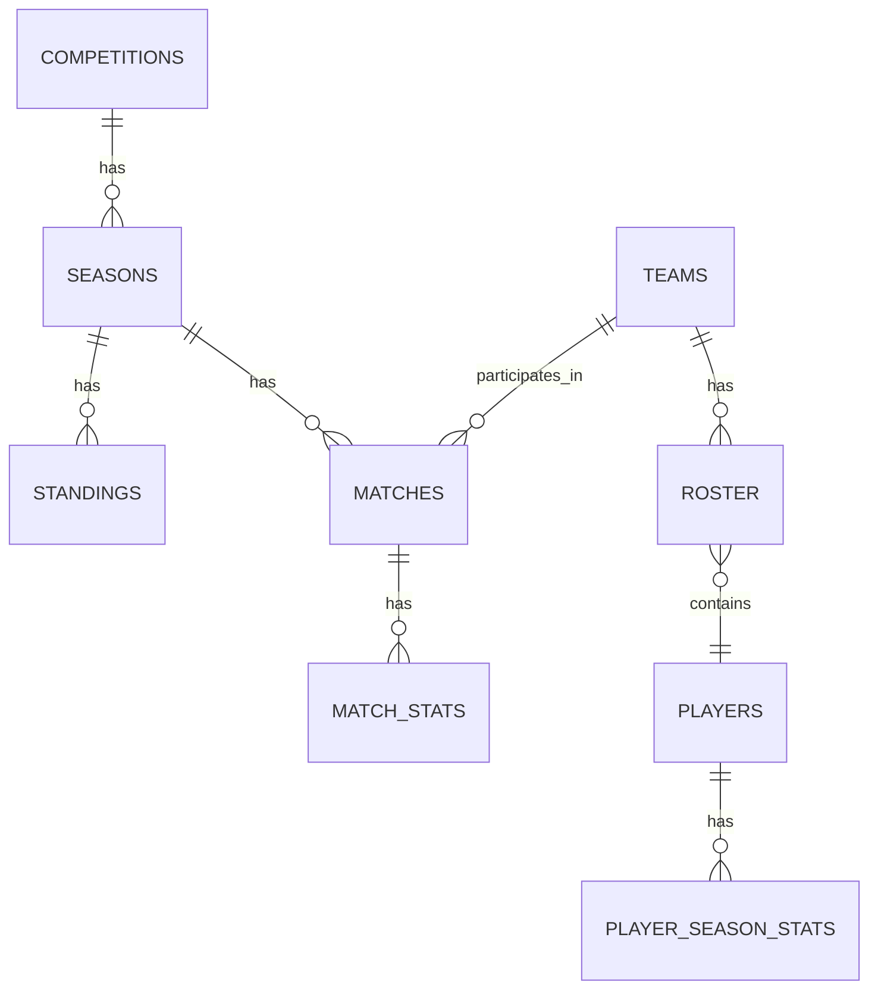

# Database Design

In this document I go over the database design for the website. This inlucdes diagram of tables and thier relationship in PostgreSQL database. In addition, the schemas of all important data points for site and models, like player, league, team data.

---

## Overview of Database Diagram

---

## Table Definitions

### competitions

| Field | Type | Constraints |
|---|---|---|
| id | INTEGER | PK |
| api_id | INTEGER | UNIQUE, NOT NULL |
| comp_name | TEXT | NOT NULL |
| country | TEXT | NOT NULL|
| logo_url | TEXT | NOT NULL|
| created_at | TIMESTAMPTZ | NOT NULL |

---

### seasons

| Field | Type | Constraints |
|---|---|---|
| id | INTEGER | PK |
| api_id | INTEGER | UNIQUE, NOT NULL |
| comp_id | INTGER | FK, NOT NULL | 
| start_date | DATE | NOT NULL |
| end_date | DATE | NOT NULL |
| is_current | BOOL | NOT NULL |
| created_at | TIMESTAMPTZ | NOT NULL |

---

### standings

| Field | Type | Constraints |
|---|---|---|
| id | INTEGER | PK |
| season_id | INTEGER | FK, NOT NULL |
| team_id | INTEGER | FK, NOT NULL |
| position | INTEGER | NOT NULL |
| games_played | INTEGER | NOT NULL |
| wins | INTEGER | NOT NULL |
| draws | INTEGER | NOT NULL |
| losses | INTEGER | NOT NULL |
| goals_for | INTEGER | NOT NULL |
| goals_against | INTEGER | NOT NULL |
| goal_difference | INTEGER | NOT NULL |
| form | TEXT | NOT NULL |
| points | INTEGER | NOT NULL |
| created_at | TIMESTAMPTZ | NOT NULL |

NOTE: UNIQUE (season_id, team_id)

---

### teams

| Field | Type | Constraints |
|---|---|---|
| id | INTEGER | PK |
| api_id | INTEGER | UNIQUE, NOT NULL |
| short_name | TEXT | NOT NULL|
| team_name | TEXT | NOT NULL |
| country | TEXT | NOT NULL|
| logo_url | TEXT | NOT NULL|
| created_at | TIMESTAMPTZ | NOT NULL |

---

### rosters

| Field | Type | Constraints |
|---|---|---|
| id | INTEGER | PK |
| team_id | INTEGER | FK, NOT NULL |
| season_id | INTEGER | FK, NOT NULL |
| player_id | INTEGER | FK, NOT NULL |
| jersey_number | INTEGER | NOT NULL |
| position | TEXT | NOT NULL |
| created_at | TIMESTAMPTZ | NOT NULL |

NOTE: UNIQUE (team_id, season_id, player_id)

---

### players

| Field | Type | Constraints |
|---|---|---|
| id | INTEGER | PK |
| api_id | INTEGER | UNIQUE, NOT NULL |
| name | TEXT | NOT NULL|
| short_name | TEXT | NOT NULL | 
| preferred_position | TEXT | NOT NULL |
| date_of_birth | DATE | NOT NULL |
| preferred_foot | TEXT | NOT NULL |
| nationality | TEXT | NOT NULL |
| market_value_euro | INTEGER |  |
| wage_annual_euro | INTEGER | |
| height_cm | INTEGER | NOT NULL |
| player_img | TEXT | |
| created_at | TIMESTAMPTZ | NOT NULL |

---

### matches

| Field | Type | Constraints |
|---|---|---|
| id | INTEGER | PK |
| api_id | INTEGER | UNIQUE, NOT NULL |
| comp_id | INTEGER | FK, NOT NULL |
| season_id | INTEGER | FK, NOT NULL|
| home_team_id | INTEGER | FK, NOT NULL |
| away_team_id | INTEGER | FK, NOT NULL |
| final_score | TEXT | |
| home_score | INTEGER | |
| away_score | INTEGER | |
| match_date | DATE | NOT NULL |
| status | TEXT | NOT NULL |
| created_at | TIMESTAMPZ | NOT NULL |

---

### match_stats

| Field | Type | Constraints |
|---|---|---|
| id | INTEGER | PK |
| match_id | INTEGER | FK, NOT NULL |
| team_id | INTEGER | FK, NOT NULL |
| fouls | INTEGER |  |
| passes | INTEGER |  |
| tackles | INTEGER |  |
| crosses | INTEGER |  |
| offsides | INTEGER |  |
| big_saves | INTEGER |  |
| clearances | INTEGER |  |
| free_kicks | INTEGER |  |
| big_chances | INTEGER |  |
| total_shots | INTEGER |  |
| corner_kicks | INTEGER |  |
| yellow_cards | INTEGER |  |
| red_cards | INTEGER |  |
| expected_goals | DECIMAL |  |
| accurate_passes | INTEGER |  |
| ball_possession | INTEGER |  |
| goals_prevented | DECIMAL |  |
| shots_on_target | INTEGER |  |
| shots_off_target | INTEGER |  |
| big_chances_missed | INTEGER |  |
| errors_lead_to_a_goal | INTEGER |  |
| errors_lead_to_a_shot | INTEGER |  |
| pass_accuracy_pct | DECIMAL |  |
| xg | DECIMAL |  |
| created_at | TIMESTAMPTZ | NOT NULL |

---

### player_season_stats

| Field | Type | Constraints |
|---|---|---|
| id | INTEGER | PK |
| player_id | INTEGER | FK, NOT NULL |
| season_id | INTEGER | FK, NOT NULL |
| comp_id | INTEGER | FK, NOT NULL|
| team_id | INTEGER | FK, NOT NULL|
| matches | INTEGER | NOT NULL |
| minutes | INTEGER | NOT NULL |
| goals | INTEGER | NOT NULL |
| assists | INTEGER | NOT NULL |
| avg_rating | DECIMAL | NOT NULL |
| created_at | TIMESTAMPTZ | NOT NULL |

NOTE: UNIQUE (player_id, season_id, comp_id, team_id)

---

